<div align="center">



</div>

---

<div align="center">

[](https://github.com/t-prod-dev)
[](https://github.com/t-prod-dev)
[](https://github.com/t-prod-dev)
[](https://github.com/t-prod-dev)

</div>

---

## 🤖 About TPROD DEV

**TPROD DEV** is an **AI Data software strategy and services** company. We partner with organizations to design, build, and operate modern data platforms — turning raw data into competitive intelligence that drives measurable business outcomes.

We combine deep technical expertise with strategic advisory capabilities to help teams at every stage of the data & AI journey: from defining a vision to shipping production-grade systems.

---

## 🚀 What We Do

<div align="center">



</div>

|  | Capability | Description |
|--|-----------|-------------|
| 🧠 | **AI Strategy** | Enterprise AI roadmaps, use-case discovery, build-vs-buy analysis and governance frameworks |
| ⚙️ | **Data Engineering** | Batch & streaming pipelines, cloud lakehouses, data mesh, and platform reliability |
| 📊 | **ML & Analytics** | Predictive modelling, LLM-powered products, BI dashboards, and self-serve analytics |
| 🤝 | **Consulting** | Embedded advisory, team enablement, data culture change, and architecture reviews |

---

## 🛠️ Technology Stack

<div align="center">

**Cloud & Infrastructure**


**Data & AI**


**Platforms & Observability**


</div>

---

## 💡 Our Approach

```
  Discovery          Architecture        Build              Scale
  ─────────          ────────────        ─────              ─────
  ┌─────────┐        ┌─────────┐        ┌─────────┐        ┌─────────┐
  │ Business│──────▶ │ Design  │──────▶ │ Sprint  │──────▶ │ Operate │
  │ Problem │        │ & Plan  │        │ & Ship  │        │   &     │
  │ Framing │        │         │        │         │        │ Improve │
  └─────────┘        └─────────┘        └─────────┘        └─────────┘
       │                  │                  │                  │
  Stakeholder         Data & AI          Agile dev         MLOps &
  workshops           blueprint          cycles            monitoring
```

We embed with your team — bringing expertise across the full data-to-AI lifecycle while transferring knowledge and building lasting internal capability.

---

## 📈 Why Data-First AI

> *"AI is only as good as the data and strategy behind it."*

Organizations that win with AI don't just experiment — they build **robust data foundations**, define **clear business outcomes**, and iterate quickly. TPROD DEV helps you do exactly that:

- ✅ **Governed, trusted data** — quality pipelines and lineage from day one
- ✅ **Outcome-oriented AI** — solving real problems, not just running proofs-of-concept
- ✅ **Speed with rigour** — agile delivery balanced with production-grade engineering
- ✅ **Sustainable capability** — your team owns the platform after we're done

---

## 🌐 Connect With Us

<div align="center">

[](https://github.com/t-prod-dev)
[](https://www.linkedin.com/company/tprod-dev)
[](https://tproddev.com)

</div>

---

<div align="center">

*Built with ❤️ by the TPROD DEV team · Transforming Data into Intelligence*

</div>
